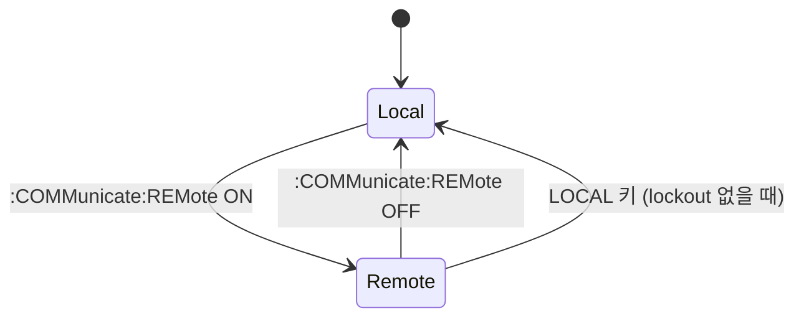
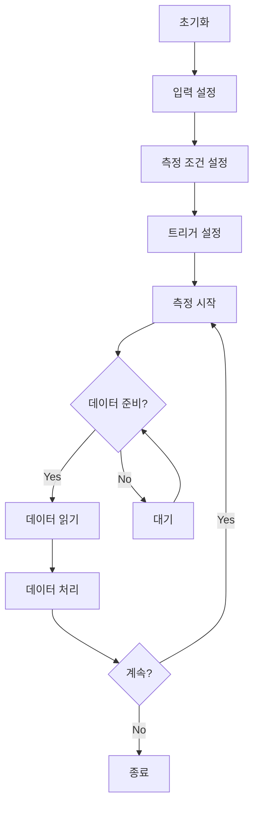

# WT1800E Precision Power Analyzer - 통신 프로그래밍 가이드

> **대상**: WT1801E/WT1802E/WT1803E/WT1804E/WT1805E/WT1806E  
> **버전**: 3rd Edition (October 2017)  
> **문서**: Engineer Quick Reference

---

## 📋 목차

1. [연결 설정](#1-연결-설정)
2. [통신 프로토콜 기초](#2-통신-프로토콜-기초)
3. [명령어 체계](#3-명령어-체계)
4. [주요 기능별 명령어](#4-주요-기능별-명령어)
5. [데이터 취득](#5-데이터-취득)
6. [에러 처리](#6-에러-처리)
7. [실전 코드 예제](#7-실전-코드-예제)

---

## 1. 연결 설정

### 1.1 인터페이스 옵션

| 인터페이스 | 프로토콜 | 커넥터 | 동시 연결 |
|---------|---------|--------|----------|
| **Ethernet** | TCP/IP (VXI-11) | RJ-45 | 1 |
| **USB** | USB 2.0 TMC | Type B | 1 |
| **GP-IB** | IEEE 488.2 | GP-IB 24핀 | 최대 15대 |

⚠️ **주의**: 하나의 인터페이스만 사용해야 함. 동시 사용 시 오동작 발생

### 1.2 Ethernet 연결

```plaintext
[PC] --- Straight Cable --- [Hub/Router] --- Straight Cable --- [WT1800E]
```

**필수 설정**:
- IP Address
- Subnet Mask  
- Default Gateway
- Timeout: 1~3600초 (기본값: Infinite)

**설정 경로**: `UTILITY` → `Remote Control` → `Network`

### 1.3 USB 연결

**요구사항**:
- YOKOGAWA USB TMC Driver 설치 필수
- Serial Number 확인: `UTILITY` → `Remote Control` → `USB`
- Windows XP/Vista/7/8/8.1/10 지원

**다운로드**: http://tmi.yokogawa.com/

---

## 2. 통신 프로토콜 기초

### 2.1 Remote/Local 모드



**Remote 모드 특징**:
- REMOTE 표시등 점등
- LOCAL 키 외 모든 키 비활성화
- 설정값은 모드 전환 시에도 유지됨

### 2.2 명령어 구조 (BNF 표기법)

| 기호 | 의미 | 예제 |
|-----|------|------|
| `<>` | 변수 | `<x>` = 1 to 6 |
| `{}` | 선택 옵션 |
 `{TYPE1\|TYPE2\|TYPE3}` |
| `[]` | 생략 가능 | `NUMeric[:NORMal]:VALue?` |
| `\|` | OR | `{ON\|OFF}` |

### 2.3 메시지 종류

```
┌─────────────────────────────────────────┐
│ Program Message (명령 전송)              │
│ - Command (설정)                         │
│ - Query (조회, ?로 끝남)                 │
└─────────────────────────────────────────┘
         ↓
┌─────────────────────────────────────────┐
│ Response Message (응답 수신)             │
│ - Header + Data                          │
│ - Data Only                              │
└─────────────────────────────────────────┘
```

**종료 문자 (Terminator)**:
- 송신: `LF` (Line Feed, \n)
- 수신: `LF` 또는 `CR+LF`

### 2.4 명령어 연결 규칙

```python
# 같은 그룹 내 명령어 연결
":INTEGrate:MODE NORMal;ACAL ON\n"

# 다른 그룹 명령어 연결 (콜론 필수)
":INTEGrate:MODE NORMal;:DISPlay:MODE NUMeric\n"

# 공통 명령어 연결
":INTEGrate:MODE NORMal;*CLS;ACAL ON\n"
```

---

## 3. 명령어 체계

### 3.1 명령어 그룹 분류

```
WT1800E Command Structure
│
├─ Communication Control
│  ├─ :COMMunicate      # 통신 설정
│  └─ :SYSTem           # 시스템 설정
│
├─ Measurement Setup
│  ├─ :INPut            # 입력 설정 (전압/전류 범위, 필터)
│  ├─ :SENSe            # 측정 조건
│  └─ :TRIGger          # 트리거 설정
│
├─ Data Acquisition
│  ├─ :MEASure          # 측정 실행 및 데이터 취득
│  ├─ :FETCh            # 측정 데이터 읽기
│  └─ :READ             # 측정 + 데이터 읽기
│
├─ Analysis & Processing
│  ├─ :CALCulate        # 계산 설정
│  ├─ :INTEGrate        # 적분 측정
│  ├─ :HSPeed           # 고속 데이터 캡처
│  └─ :HARMonics        # 고조파 분석
│
├─ Display & Output
│  ├─ :DISPlay          # 화면 표시
│  ├─ :NUMeric          # 수치 표시
│  └─ :HCOPy            # 출력/인쇄
│
└─ Status & Error
   ├─ :STATus           # 상태 보고
   └─ :SYSTem:ERRor     # 에러 조회
```

### 3.2 공통 명령어 (IEEE 488.2)

| 명령어 | 기능 | 예제 |
|--------|------|------|
| `*IDN?` | 기기 식별 | 제조사, 모델명, 시리얼, 펌웨어 버전 |
| `*RST` | 리셋 | 공장 초기값으로 복귀 |
| `*CLS` | 상태 클리어 | 에러 큐 및 이벤트 레지스터 초기화 |
| `*ESE` | 이벤트 활성화 | 표준 이벤트 레지스터 마스크 |
| `*ESR?` | 이벤트 조회 | 표준 이벤트 레지스터 읽기 |
| `*OPC` | 동작 완료 | 모든 명령 실행 완료 시 설정 |
| `*OPC?` | 동작 완료 조회 | 완료 여부 확인 (1 반환) |
| `*WAI` | 대기 | 이전 명령 완료까지 대기 |
| `*STB?` | 상태 바이트 | 상태 바이트 조회 |

---

## 4. 주요 기능별 명령어

### 4.1 입력 설정 (INPut Group)

#### 4.1.1 전압 범위 설정

```python
# 모든 엘리먼트 전압 범위 설정
":INPut:VOLTage:RANGe:ALL 300V\n"

# 특정 엘리먼트 (Element 1) 전압 범위 설정  
":INPut:VOLTage:RANGe:ELEMent1 15V\n"

# 전압 범위 조회
":INPut:VOLTage:RANGe?\n"
# 응답: :INPut:VOLTage:RANGe 1,300.0E+00,2,300.0E+00,...

# Auto Range 설정
":INPut:VOLTage:AUTO:ALL ON\n"
```

**사용 가능 전압 범위**:
- 15V, 30V, 60V, 150V, 300V, 600V, 1000V (모델별 상이)

#### 4.1.2 전류 범위 설정

```python
# 모든 엘리먼트 전류 범위 설정
":INPut:CURRent:RANGe:ALL 5A\n"

# 특정 엘리먼트 전류 범위
":INPut:CURRent:RANGe:ELEMent2 1A\n"

# Crest Factor별 범위
# CF=3: 1A, 2A, 5A, 10A, 20A, 50A (50A 입력 엘리먼트)
# CF=6: 500mA, 1A, 2.5A, 5A, 10A, 25A (50A 입력 엘리먼트)
```

#### 4.1.3 필터 설정

```python
# Line Filter 설정 (주파수 필터)
":INPut:FILTer:LINE:ALL 10KHZ\n"
# 범위: 500Hz ~ 100kHz

# Frequency Filter 설정
":INPut:FILTer:FREQuency:ALL 1HZ\n"
# 범위: 0.5Hz ~ 1kHz

# 필터 상태 조회
":INPut:FILTer?\n"
```

#### 4.1.4 배선 시스템 설정

```python
# 단상 2선식
":INPut:WIRing P1P2\n"

# 단상 3선식  
":INPut:WIRing P1P3\n"

# 3상 3선식
":INPut:WIRing 3P3W\n"

# 3상 4선식
":INPut:WIRing 3P4W\n"

# 조회
":INPut:WIRing?\n"
```

### 4.2 측정 설정 (MEASure Group)

#### 4.2.1 측정 항목 정의

```python
# Element <x>: 1~6 (측정 채널)
# Function 옵션:
측정_항목 = {
    # 전압 관련
    "URMS": "전압 실효값",
    "UMN": "전압 평균값",
    "UDC": "전압 DC 성분",
    "UAC": "전압 AC 성분",
    "UPPeak": "전압 양의 피크",
    "UMPeak": "전압 음의 피크",
    
    # 전류 관련
    "IRMS": "전류 실효값",
    "IMN": "전류 평균값",  
    "IDC": "전류 DC 성분",
    "IAC": "전류 AC 성분",
    
    # 전력 관련
    "P": "유효 전력",
    "S": "피상 전력",
    "Q": "무효 전력",
    "LAMBDA": "역률 (λ)",
    "PHI": "위상각 (φ)",
    
    # 주파수
    "FU": "전압 주파수",
    "FI": "전류 주파수",
    
    # 적산 전력량
    "WP": "유효 전력량",
    "WS": "피상 전력량",
    "WQ": "무효 전력량",
    
    # 효율
    "ETA": "효율 (η)"
}
```

#### 4.2.2 측정 실행

```python
# 단일 측정 (Element 1의 전압 실효값)
":MEASure:NORMal:VALue? URMS,1\n"
# 응답: 220.5E+00

# 여러 항목 동시 측정
":MEASure:NORMal:VALue? URMS,1,IRMS,1,P,1\n"  
# 응답: 220.5E+00,10.2E+00,2.25E+03

# 모든 측정 항목 조회
":MEASure:NORMal:VALue? ALL\n"
```

### 4.3 데이터 취득 (FETCh/READ)

```python
# FETCh: 버퍼의 데이터만 읽기 (새로 측정 안함)
":FETCh:NORMal:VALue? URMS,1,IRMS,1,P,1\n"

# READ: 측정 후 데이터 읽기
":READ:NORMal:VALue? URMS,1,IRMS,1,P,1\n"

# 배열 데이터 취득 (모든 엘리먼트)
":NUMeric:NORMal:ITEM1 URMS,1\n"  # Item 1에 설정
":NUMeric:NORMal:ITEM2 IRMS,1\n"  # Item 2에 설정
":NUMeric:NORMal:VALue?\n"        # 전체 조회
```

### 4.4 적분 측정 (INTEGrate Group)

```python
# 적분 모드 설정
":INTEGrate:MODE NORMal\n"      # 일반 모드
":INTEGrate:MODE CONTinuous\n"  # 연속 모드

# 적분 타이머 설정 (초 단위)
":INTEGrate:TIMer 3600\n"  # 1시간

# 적분 시작
":INTEGrate:STARt\n"

# 적분 정지
":INTEGrate:STOP\n"

# 적분 리셋
":INTEGrate:RESet\n"

# 적분 실시간 조회
":INTEGrate:RTIMe?\n"
# 응답: 시작시간,종료시간

# 적분 데이터 취득
":INTEGrate:VALue? WP,1\n"  # Element 1의 유효 전력량
```

### 4.5 고속 데이터 캡처 (HSPeed Group)

```python
# 고속 모드 활성화
":HSPeed:MODE ON\n"

# 샘플링 레이트 설정
":HSPeed:INTerval 100US\n"  # 100μs (10kHz)
# 범위: 10μs ~ 200ms

# 데이터 포인트 수 설정
":HSPeed:POINts 10000\n"

# 측정 항목 설정 (전압 RMS)
":HSPeed:MEASuring:U1 RMS\n"
# 옵션: RMS, MEAN, DC, RMEAN

# 모든 전압 채널 일괄 설정
":HSPeed:MEASuring:UALL RMS\n"

# 캡처 시작
":HSPeed:STARt\n"

# 캡처 상태 확인
":HSPeed:STATe?\n"
# 응답: 0 (완료), 1 (진행중)

# 데이터 읽기
":HSPeed:DATA? U1\n"  # Element 1 전압 데이터
```

### 4.6 고조파 분석 (HARMonics Group)

```python
# 고조파 측정 활성화
":HARMonics:MODE ON\n"

# 고조파 차수 설정 (최대 100차까지)
":HARMonics:ORDer 50\n"

# 측정 시작
":HARMonics:STARt\n"

# 고조파 데이터 취득
# Element 1, 전압 5차 고조파 실효값
":HARMonics:VALue? URMS,1,5\n"

# THD (Total Harmonic Distortion) 조회
":HARMonics:THD? U,1\n"  # Element 1 전압 THD
":HARMonics:THD? I,1\n"  # Element 1 전류 THD

# 모든 고조파 데이터 조회
":HARMonics:DATA? U,1\n"  # Element 1 전압 고조파 배열
```

---

## 5. 데이터 취득

### 5.1 측정 흐름도



### 5.2 실시간 측정 패턴

```python
# Pattern 1: 단순 폴링
def simple_polling():
    # 측정 설정
    send(":INPut:VOLTage:RANGe:ALL 300V")
    send(":INPut:CURRent:RANGe:ALL 5A")
    
    while True:
        # 데이터 취득
        response = query(":MEASure:NORMal:VALue? URMS,1,IRMS,1,P,1")
        voltage, current, power = parse_response(response)
        
        # 데이터 처리
        process_data(voltage, current, power)
        
        time.sleep(0.1)  # 100ms 주기

# Pattern 2: 트리거 동기화
def triggered_measurement():
    # 트리거 설정
    send(":TRIGger:SOURce EXTernal")
    send(":TRIGger:SLOPe POSitive")
    
    # 측정 대기
    send(":INITiate")
    
    # 트리거 대기
    while True:
        status = query(":STATus:OPERation:CONDition?")
        if is_measurement_complete(status):
            break
        time.sleep(0.01)
    
    # 데이터 취득
    data = query(":FETCh:NORMal:VALue? ALL")

# Pattern 3: 연속 측정 (버퍼)
def continuous_buffered():
    # 고속 모드 설정
    send(":HSPeed:MODE ON")
    send(":HSPeed:INTerval 1MS")  # 1ms 간격
    send(":HSPeed:POINts 1000")   # 1000 포인트
    
    # 측정 시작
    send(":HSPeed:STARt")
    
    # 완료 대기
    wait_for_completion()
    
    # 전체 데이터 취득
    data = query(":HSPeed:DATA? U1")
    waveform = parse_waveform(data)
```

### 5.3 데이터 포맷

```python
# ASCII 포맷 (기본값)
response = ":INPut:VOLTage:RANGe 1,300.0E+00,2,300.0E+00"

# 파싱 예제
def parse_ascii_data(response):
    # 헤더 제거
    if response.startswith(':'):
        parts = response.split(' ', 1)
        header = parts[0]
        data = parts[1] if len(parts) > 1 else ''
    else:
        data = response
    
    # 쉼표로 분리
    values = data.split(',')
    
    # 숫자 변환
    result = []
    for i in range(0, len(values), 2):
        element = int(values[i])
        value = float(values[i+1])
        result.append((element, value))
    
    return result

# 예제 사용
response = ":INPut:VOLTage:RANGe 1,300.0E+00,2,150.0E+00"
data = parse_ascii_data(response)
# [(1, 300.0), (2, 150.0)]
```

---

## 6. 에러 처리

### 6.1 에러 확인

```python
# 에러 조회
":SYSTem:ERRor?\n"
# 응답: 에러코드,"에러 메시지"
# 예: 0,"No error"
# 예: 113,"Undefined header"

# 에러 큐 읽기 (반복 조회로 모든 에러 확인)
def read_all_errors():
    errors = []
    while True:
        response = query(":SYSTem:ERRor?")
        code, message = parse_error(response)
        if code == 0:
            break
        errors.append((code, message))
    return errors
```

### 6.2 주요 에러 코드

| 코드 | 분류 | 설명 | 대응 |
|------|------|------|------|
| 0 | - | 에러 없음 | - |
| -100 | Command | 명령어 에러 | 문법 확인 |
| -102 | Command | 문법 에러 | 명령어 형식 확인 |
| -109 | Command | 파라미터 누락 | 필수 파라미터 추가 |
| -113 | Command | 정의되지 않은 헤더 | 명령어 철자 확인 |
| -200 | Data | 실행 에러 | 명령 순서/상태 확인 |
| -224 | Data | 파라미터 범위 초과 | 허용 범위 확인 |
| -350 | Query | 큐 오버플로우 | 데이터 읽기 빈도 증가 |
| 100 | Device | 내부 에러 | 재시작 필요 |
| 221 | Device | 설정 충돌 | 설정 조합 재확인 |

### 6.3 상태 레지스터

```python
# Status Byte (STB) 구조
STB_비트 = {
    0: "Unused",
    1: "Unused", 
    2: "Error Queue (에러 발생)",
    3: "Questionable Status",
    4: "Message Available (MAV, 출력 버퍼 데이터 있음)",
    5: "Event Status Bit (ESB)",
    6: "Master Summary Status (MSS)",
    7: "Operation Status"
}

# 상태 확인
response = query("*STB?")
stb = int(response)

# 비트 체크
if stb & (1 << 2):  # Bit 2
    print("에러 발생 - 에러 큐 확인 필요")
    errors = read_all_errors()

if stb & (1 << 4):  # Bit 4 - MAV
    print("출력 버퍼에 데이터 있음")
```

### 6.4 에러 처리 베스트 프랙티스

```python
class WT1800E_ErrorHandler:
    def __init__(self, instrument):
        self.inst = instrument
    
    def send_command(self, command):
        """에러 체크가 포함된 명령 전송"""
        try:
            self.inst.write(command)
            return self.check_errors()
        except Exception as e:
            print(f"통신 에러: {e}")
            return False
    
    def check_errors(self):
        """에러 체크 및 로깅"""
        errors = []
        while True:
            response = self.inst.query(":SYSTem:ERRor?")
            code, msg = self.parse_error(response)
            
            if code == 0:
                break
                
            errors.append({
                'code': code,
                'message': msg,
                'timestamp': time.time()
            })
            
            # 치명적 에러 처리
            if code >= 100:
                self.handle_critical_error(code, msg)
        
        if errors:
            self.log_errors(errors)
            return False
        return True
    
    def parse_error(self, response):
        """에러 응답 파싱"""
        # 예: '-113,"Undefined header"'
        parts = response.split(',', 1)
        code = int(parts[0])
        message = parts[1].strip('"') if len(parts) > 1 else ""
        return code, message
    
    def handle_critical_error(self, code, message):
        """치명적 에러 처리"""
        print(f"치명적 에러 {code}: {message}")
        if code == 100:
            print("기기 재시작 권장")
        # 필요시 재연결 로직
```

---

## 7. 실전 코드 예제

### 7.1 Python + PyVISA 기본 연결

```python
import pyvisa
import time

class WT1800E:
    def __init__(self, resource_string):
        """
        resource_string 예:
        - Ethernet: "TCPIP0::192.168.1.100::inst0::INSTR"
        - USB: "USB0::0x0B21::0x0014::91T123456::INSTR"
        - GP-IB: "GPIB0::1::INSTR"
        """
        self.rm = pyvisa.ResourceManager()
        self.inst = self.rm.open_resource(resource_string)
        
        # 타임아웃 설정 (ms)
        self.inst.timeout = 10000
        
        # 종료 문자 설정
        self.inst.write_termination = '\n'
        self.inst.read_termination = '\n'
    
    def identify(self):
        """기기 식별"""
        return self.inst.query("*IDN?")
    
    def reset(self):
        """리셋"""
        self.inst.write("*RST")
        time.sleep(2)  # 리셋 대기
    
    def clear_status(self):
        """상태 클리어"""
        self.inst.write("*CLS")
    
    def write(self, command):
        """명령 전송"""
        self.inst.write(command)
    
    def query(self, command):
        """조회 명령"""
        return self.inst.query(command)
    
    def check_errors(self):
        """에러 확인"""
        errors = []
        while True:
            response = self.query(":SYSTem:ERRor?")
            if response.startswith('0'):
                break
            errors.append(response)
        return errors
    
    def close(self):
        """연결 종료"""
        self.inst.close()
        self.rm.close()

# 사용 예제
if __name__ == "__main__":
    # 연결
    wt = WT1800E("TCPIP0::192.168.1.100::inst0::INSTR")
    
    # 기기 정보 확인
    print("기기 정보:", wt.identify())
    
    # 초기화
    wt.reset()
    wt.clear_status()
    
    # 입력 설정
    wt.write(":INPut:VOLTage:RANGe:ALL 300V")
    wt.write(":INPut:CURRent:RANGe:ALL 5A")
    
    # 에러 확인
    errors = wt.check_errors()
    if errors:
        print("에러 발생:", errors)
    
    # 측정
    data = wt.query(":MEASure:NORMal:VALue? URMS,1,IRMS,1,P,1")
    print("측정 데이터:", data)
    
    # 종료
    wt.close()
```

### 7.2 실시간 전력 모니터링

```python
import pyvisa
import time
import matplotlib.pyplot as plt
from collections import deque

class PowerMonitor:
    def __init__(self, resource_string, element=1):
        self.wt = WT1800E(resource_string)
        self.element = element
        
        # 데이터 버퍼 (최근 100개)
        self.time_data = deque(maxlen=100)
        self.power_data = deque(maxlen=100)
        self.voltage_data = deque(maxlen=100)
        self.current_data = deque(maxlen=100)
        
        self.start_time = time.time()
    
    def setup(self):
        """측정 설정"""
        self.wt.reset()
        self.wt.clear_status()
        
        # 입력 범위 설정
        self.wt.write(":INPut:VOLTage:RANGe:ALL 300V")
        self.wt.write(":INPut:CURRent:RANGe:ALL 5A")
        
        # Auto Range 활성화
        self.wt.write(":INPut:VOLTage:AUTO:ALL ON")
        self.wt.write(":INPut:CURRent:AUTO:ALL ON")
        
        # 필터 설정
        self.wt.write(":INPut:FILTer:LINE:ALL 10KHZ")
        
        print("설정 완료")
    
    def measure_once(self):
        """단일 측정"""
        # 데이터 취득
        cmd = f":MEASure:NORMal:VALue? URMS,{self.element},IRMS,{self.element},P,{self.element}"
        response = self.wt.query(cmd)
        
        # 파싱
        values = [float(x) for x in response.split(',')]
        
        return {
            'voltage': values[0],
            'current': values[1],
            'power': values[2],
            'timestamp': time.time() - self.start_time
        }
    
    def continuous_monitor(self, duration=60, interval=0.1):
        """연속 모니터링"""
        print(f"{duration}초 동안 {interval}초 간격으로 측정 시작...")
        
        end_time = time.time() + duration
        
        try:
            while time.time() < end_time:
                # 측정
                data = self.measure_once()
                
                # 데이터 저장
                self.time_data.append(data['timestamp'])
                self.voltage_data.append(data['voltage'])
                self.current_data.append(data['current'])
                self.power_data.append(data['power'])
                
                # 출력
                print(f"[{data['timestamp']:.1f}s] "
                      f"V={data['voltage']:.2f}V, "
                      f"I={data['current']:.3f}A, "
                      f"P={data['power']:.2f}W")
                
                # 대기
                time.sleep(interval)
        
        except KeyboardInterrupt:
            print("\n측정 중단")
        
        return self.get_statistics()
    
    def get_statistics(self):
        """통계 계산"""
        if not self.power_data:
            return None
        
        import statistics
        
        return {
            'avg_power': statistics.mean(self.power_data),
            'max_power': max(self.power_data),
            'min_power': min(self.power_data),
            'avg_voltage': statistics.mean(self.voltage_data),
            'avg_current': statistics.mean(self.current_data),
            'measurements': len(self.power_data)
        }
    
    def plot_results(self):
        """결과 플롯"""
        if not self.time_data:
            print("데이터 없음")
            return
        
        fig, (ax1, ax2, ax3) = plt.subplots(3, 1, figsize=(10, 8))
        
        # 전압
        ax1.plot(self.time_data, self.voltage_data, 'b-')
        ax1.set_ylabel('Voltage (V)')
        ax1.grid(True)
        
        # 전류
        ax2.plot(self.time_data, self.current_data, 'r-')
        ax2.set_ylabel('Current (A)')
        ax2.grid(True)
        
        # 전력
        ax3.plot(self.time_data, self.power_data, 'g-')
        ax3.set_xlabel('Time (s)')
        ax3.set_ylabel('Power (W)')
        ax3.grid(True)
        
        plt.tight_layout()
        plt.show()
    
    def close(self):
        """종료"""
        self.wt.close()

# 사용 예제
if __name__ == "__main__":
    monitor = PowerMonitor("TCPIP0::192.168.1.100::inst0::INSTR", element=1)
    
    # 설정
    monitor.setup()
    
    # 60초 동안 0.5초 간격 모니터링
    stats = monitor.continuous_monitor(duration=60, interval=0.5)
    
    # 통계 출력
    if stats:
        print("\n=== 측정 통계 ===")
        print(f"평균 전력: {stats['avg_power']:.2f} W")
        print(f"최대 전력: {stats['max_power']:.2f} W")
        print(f"최소 전력: {stats['min_power']:.2f} W")
        print(f"평균 전압: {stats['avg_voltage']:.2f} V")
        print(f"평균 전류: {stats['avg_current']:.3f} A")
        print(f"총 측정 횟수: {stats['measurements']}")
    
    # 그래프 표시
    monitor.plot_results()
    
    # 종료
    monitor.close()
```

### 7.3 적분 측정 (전력량 측정)

```python
class IntegrationMeasure:
    def __init__(self, wt1800e):
        self.wt = wt1800e
    
    def setup_integration(self, mode='normal', timer=3600):
        """
        적분 설정
        mode: 'normal' 또는 'continuous'
        timer: 적분 시간 (초)
        """
        # 적분 모드 설정
        if mode.lower() == 'normal':
            self.wt.write(":INTEGrate:MODE NORMal")
        else:
            self.wt.write(":INTEGrate:MODE CONTinuous")
        
        # 타이머 설정
        self.wt.write(f":INTEGrate:TIMer {timer}")
        
        print(f"적분 모드: {mode}, 타이머: {timer}초")
    
    def start_integration(self):
        """적분 시작"""
        self.wt.write(":INTEGrate:STARt")
        print("적분 시작")
    
    def stop_integration(self):
        """적분 정지"""
        self.wt.write(":INTEGrate:STOP")
        print("적분 정지")
    
    def reset_integration(self):
        """적분 리셋"""
        self.wt.write(":INTEGrate:RESet")
        print("적분 리셋")
    
    def get_integration_time(self):
        """적분 경과 시간 조회"""
        response = self.wt.query(":INTEGrate:RTIMe?")
        # 응답: 시작시간,종료시간
        times = response.split(',')
        return {
            'start': times[0],
            'end': times[1] if len(times) > 1 else None
        }
    
    def get_integration_data(self, element=1):
        """적분 데이터 취득"""
        # 유효 전력량 (Wh)
        wp = self.wt.query(f":INTEGrate:VALue? WP,{element}")
        
        # 피상 전력량 (VAh)
        ws = self.wt.query(f":INTEGrate:VALue? WS,{element}")
        
        # 무효 전력량 (varh)
        wq = self.wt.query(f":INTEGrate:VALue? WQ,{element}")
        
        return {
            'active_energy': float(wp),      # Wh
            'apparent_energy': float(ws),    # VAh
            'reactive_energy': float(wq)     # varh
        }
    
    def measure_energy(self, duration, element=1):
        """
        지정 시간 동안 전력량 측정
        duration: 측정 시간 (초)
        """
        print(f"\n{duration}초 동안 전력량 측정 시작...")
        
        # 설정
        self.setup_integration(mode='normal', timer=duration)
        
        # 리셋 후 시작
        self.reset_integration()
        self.start_integration()
        
        # 진행 상황 모니터링
        start_time = time.time()
        try:
            while True:
                elapsed = time.time() - start_time
                
                if elapsed >= duration:
                    break
                
                # 중간 데이터 확인
                data = self.get_integration_data(element)
                
                print(f"[{elapsed:.1f}s/{duration}s] "
                      f"유효 전력량: {data['active_energy']:.3f} Wh")
                
                time.sleep(1)  # 1초마다 확인
        
        except KeyboardInterrupt:
            print("\n측정 중단")
            self.stop_integration()
        
        # 최종 데이터
        final_data = self.get_integration_data(element)
        self.stop_integration()
        
        print("\n=== 적분 측정 결과 ===")
        print(f"유효 전력량: {final_data['active_energy']:.3f} Wh")
        print(f"피상 전력량: {final_data['apparent_energy']:.3f} VAh")
        print(f"무효 전력량: {final_data['reactive_energy']:.3f} varh")
        
        return final_data

# 사용 예제
if __name__ == "__main__":
    wt = WT1800E("TCPIP0::192.168.1.100::inst0::INSTR")
    integrator = IntegrationMeasure(wt)
    
    # 1시간(3600초) 동안 전력량 측정
    energy_data = integrator.measure_energy(duration=3600, element=1)
    
    wt.close()
```

### 7.4 고속 데이터 캡처 및 파형 분석

```python
import numpy as np

class WaveformCapture:
    def __init__(self, wt1800e):
        self.wt = wt1800e
    
    def setup_capture(self, interval_us=100, points=10000):
        """
        고속 캡처 설정
        interval_us: 샘플링 간격 (μs)
        points: 데이터 포인트 수
        """
        # 고속 모드 활성화
        self.wt.write(":HSPeed:MODE ON")
        
        # 샘플링 간격 설정
        self.wt.write(f":HSPeed:INTerval {interval_us}US")
        
        # 포인트 수 설정
        self.wt.write(f":HSPeed:POINts {points}")
        
        print(f"캡처 설정: {interval_us}μs 간격, {points} 포인트")
        print(f"총 시간: {interval_us * points / 1e6:.3f}초")
    
    def capture_waveform(self, element=1, channel='U'):
        """
        파형 캡처
        element: 측정 엘리먼트 (1~6)
        channel: 'U' (전압) 또는 'I' (전류)
        """
        # 측정 모드 설정 (RMS)
        self.wt.write(f":HSPeed:MEASuring:{channel}{element} RMS")
        
        # 캡처 시작
        self.wt.write(":HSPeed:STARt")
        print("캡처 시작...")
        
        # 완료 대기
        while True:
            state = self.wt.query(":HSPeed:STATe?")
            if state.strip() == '0':  # 완료
                break
            time.sleep(0.1)
        
        print("캡처 완료")
        
        # 데이터 읽기
        data_str = self.wt.query(f":HSPeed:DATA? {channel}{element}")
        
        # 파싱
        values = [float(x) for x in data_str.split(',')]
        
        return np.array(values)
    
    def analyze_waveform(self, waveform, sampling_rate):
        """
        파형 분석
        waveform: numpy 배열
        sampling_rate: 샘플링 주파수 (Hz)
        """
        results = {}
        
        # 기본 통계
        results['rms'] = np.sqrt(np.mean(waveform**2))
        results['mean'] = np.mean(waveform)
        results['peak_to_peak'] = np.ptp(waveform)
        results['max'] = np.max(waveform)
        results['min'] = np.min(waveform)
        results['std'] = np.std(waveform)
        
        # FFT 분석
        fft = np.fft.fft(waveform)
        freqs = np.fft.fftfreq(len(waveform), 1/sampling_rate)
        
        # 양의 주파수만
        positive_freqs = freqs[:len(freqs)//2]
        positive_fft = np.abs(fft[:len(fft)//2])
        
        # 주파수 성분
        fundamental_idx = np.argmax(positive_fft[1:]) + 1  # DC 제외
        results['fundamental_freq'] = positive_freqs[fundamental_idx]
        results['fundamental_amplitude'] = positive_fft[fundamental_idx] / len(waveform) * 2
        
        return results, (positive_freqs, positive_fft)
    
    def plot_waveform(self, waveform, sampling_rate, title="Waveform"):
        """파형 플롯"""
        import matplotlib.pyplot as plt
        
        # 시간 축
        time_axis = np.arange(len(waveform)) / sampling_rate
        
        fig, (ax1, ax2) = plt.subplots(2, 1, figsize=(12, 8))
        
        # 시간 영역 파형
        ax1.plot(time_axis * 1000, waveform)  # ms 단위
        ax1.set_xlabel('Time (ms)')
        ax1.set_ylabel('Amplitude')
        ax1.set_title(f'{title} - Time Domain')
        ax1.grid(True)
        
        # 주파수 영역 (FFT)
        results, (freqs, fft) = self.analyze_waveform(waveform, sampling_rate)
        
        ax2.plot(freqs, fft)
        ax2.set_xlabel('Frequency (Hz)')
        ax2.set_ylabel('Magnitude')
        ax2.set_title(f'{title} - Frequency Domain (FFT)')
        ax2.set_xlim([0, sampling_rate/2])
        ax2.grid(True)
        
        plt.tight_layout()
        plt.show()
        
        return results

# 사용 예제
if __name__ == "__main__":
    wt = WT1800E("TCPIP0::192.168.1.100::inst0::INSTR")
    capture = WaveformCapture(wt)
    
    # 캡처 설정: 100μs 간격, 10000 포인트 (총 1초)
    capture.setup_capture(interval_us=100, points=10000)
    
    # 전압 파형 캡처 (Element 1)
    voltage_waveform = capture.capture_waveform(element=1, channel='U')
    
    # 샘플링 주파수 계산
    sampling_rate = 1e6 / 100  # 100μs 간격 = 10kHz
    
    # 파형 분석 및 플롯
    results = capture.plot_waveform(voltage_waveform, sampling_rate, "Voltage Waveform")
    
    # 분석 결과 출력
    print("\n=== 파형 분석 결과 ===")
    print(f"RMS: {results['rms']:.3f}")
    print(f"평균: {results['mean']:.3f}")
    print(f"Peak-to-Peak: {results['peak_to_peak']:.3f}")
    print(f"기본 주파수: {results['fundamental_freq']:.2f} Hz")
    print(f"기본파 진폭: {results['fundamental_amplitude']:.3f}")
    
    wt.close()
```

### 7.5 멀티 엘리먼트 동시 측정

```python
class MultiElementMeasure:
    def __init__(self, wt1800e):
        self.wt = wt1800e
        self.num_elements = 6  # WT1806E 기준
    
    def measure_all_elements(self, functions=['URMS', 'IRMS', 'P', 'S', 'Q', 'LAMBDA']):
        """
        모든 엘리먼트 동시 측정
        functions: 측정할 항목 리스트
        """
        results = {}
        
        for element in range(1, self.num_elements + 1):
            # 각 엘리먼트별로 지정된 항목 측정
            query_parts = []
            for func in functions:
                query_parts.append(f"{func},{element}")
            
            query_cmd = ":MEASure:NORMal:VALue? " + ",".join(query_parts)
            
            try:
                response = self.wt.query(query_cmd)
                values = [float(x) for x in response.split(',')]
                
                # 딕셔너리 형태로 저장
                results[f'Element_{element}'] = dict(zip(functions, values))
            
            except Exception as e:
                print(f"Element {element} 측정 실패: {e}")
                results[f'Element_{element}'] = None
        
        return results
    
    def calculate_total_power(self, results):
        """전체 전력 합산"""
        total_active = 0
        total_apparent = 0
        total_reactive = 0
        
        for element_data in results.values():
            if element_data:
                total_active += element_data.get('P', 0)
                total_apparent += element_data.get('S', 0)
                total_reactive += element_data.get('Q', 0)
        
        # 전체 역률 계산
        total_pf = total_active / total_apparent if total_apparent != 0 else 0
        
        return {
            'total_active_power': total_active,
            'total_apparent_power': total_apparent,
            'total_reactive_power': total_reactive,
            'total_power_factor': total_pf
        }
    
    def display_results(self, results, totals):
        """결과 표시"""
        print("\n" + "="*80)
        print("  엘리먼트별 측정 결과")
        print("="*80)
        print(f"{'Element':<10} {'Voltage':<12} {'Current':<12} {'Active P':<12} {'Apparent S':<12} {'PF':<8}")
        print("-"*80)
        
        for element, data in results.items():
            if data:
                print(f"{element:<10} "
                      f"{data.get('URMS', 0):>10.2f} V  "
                      f"{data.get('IRMS', 0):>10.3f} A  "
                      f"{data.get('P', 0):>10.2f} W  "
                      f"{data.get('S', 0):>10.2f} VA "
                      f"{data.get('LAMBDA', 0):>7.3f}")
        
        print("="*80)
        print(f"{'TOTAL':<10} "
              f"{'':<12} {'':<12} "
              f"{totals['total_active_power']:>10.2f} W  "
              f"{totals['total_apparent_power']:>10.2f} VA "
              f"{totals['total_power_factor']:>7.3f}")
        print("="*80)

# 사용 예제
if __name__ == "__main__":
    wt = WT1800E("TCPIP0::192.168.1.100::inst0::INSTR")
    multi = MultiElementMeasure(wt)
    
    # 모든 엘리먼트 측정
    results = multi.measure_all_elements()
    
    # 합계 계산
    totals = multi.calculate_total_power(results)
    
    # 결과 표시
    multi.display_results(results, totals)
    
    wt.close()
```

---

## 8. 부록

### 8.1 명령어 빠른 참조

| 기능 | 명령어 | 예제 |
|------|--------|------|
| **기기 식별** | `*IDN?` | `*IDN?` |
| **리셋** | `*RST` | `*RST` |
| **에러 조회** | `:SYSTem:ERRor?` | `:SYST:ERR?` |
| **전압 범위** | `:INPut:VOLTage:RANGe` | `:INP:VOLT:RANG:ALL 300V` |
| **전류 범위** | `:INPut:CURRent:RANGe` | `:INP:CURR:RANG:ALL 5A` |
| **측정** | `:MEASure:NORMal:VALue?` | `:MEAS:NORM:VAL? URMS,1` |
| **적분 시작** | `:INTEGrate:STARt` | `:INT:STAR` |
| **고속 캡처** | `:HSPeed:STARt` | `:HSP:STAR` |

### 8.2 자주 사용하는 Function 코드

```python
COMMON_FUNCTIONS = {
    # 전압
    'URMS': '전압 실효값',
    'UDC': '전압 DC 성분',
    'UAC': '전압 AC 성분',
    'UPPeak': '전압 정극성 피크',
    'UMPeak': '전압 부극성 피크',
    'UMN': '전압 평균값',
    
    # 전류
    'IRMS': '전류 실효값',
    'IDC': '전류 DC 성분',
    'IAC': '전류 AC 성분',
    'IMN': '전류 평균값',
    
    # 전력
    'P': '유효 전력 (W)',
    'S': '피상 전력 (VA)',
    'Q': '무효 전력 (var)',
    
    # 역률/위상
    'LAMBDA': '역률 λ',
    'PHI': '위상각 φ (degree)',
    
    # 주파수
    'FU': '전압 주파수 (Hz)',
    'FI': '전류 주파수 (Hz)',
    
    # 전력량 (적분)
    'WP': '유효 전력량 (Wh)',
    'WS': '피상 전력량 (VAh)',
    'WQ': '무효 전력량 (varh)',
    
    # 효율
    'ETA': '효율 η (%)'
}
```

### 8.3 문제 해결 가이드

| 증상 | 원인 | 해결 방법 |
|------|------|----------|
| 연결 안됨 | IP 주소 오류 | 네트워크 설정 확인 |
| 타임아웃 | 네트워크 지연 | 타임아웃 값 증가 |
| 명령어 에러 | 문법 오류 | 매뉴얼 확인, 콜론/쉼표 체크 |
| 데이터 없음 | 측정 미완료 | *OPC? 로 완료 확인 |
| Over Range | 범위 초과 | Auto Range 활성화 또는 범위 증가 |
| 느린 응답 | 필터 설정 | 필터 대역폭 조정 |

### 8.4 성능 최적화 팁

1. **명령어 그룹화**: 여러 명령을 세미콜론으로 연결
2. **Auto Range 활용**: 범위 자동 조정으로 정확도 향상
3. **적절한 필터**: 노이즈와 응답속도 균형
4. **버퍼 활용**: FETCh로 재측정 없이 데이터 읽기
5. **에러 체크**: 주기적으로 에러 큐 확인

### 8.5 참고 자료

- **공식 매뉴얼**: IM WT1801E-17EN
- **Features Guide**: IM WT1801E-01EN
- **User's Manual**: IM WT1801E-02EN
- **TMCTL 라이브러리**: http://tmi.yokogawa.com/
- **IEEE 488.2 표준**: Appendix 2

---

## 📝 라이센스

이 문서는 YOKOGAWA WT1800E 공식 매뉴얼을 기반으로 작성되었습니다.  
© 2016-2017 Yokogawa Test & Measurement Corporation

---

**작성일**: 2025-11-04  
**문서 버전**: 1.0  
**대상 독자**: 전력 측정 엔지니어, 테스트 자동화 개발자
