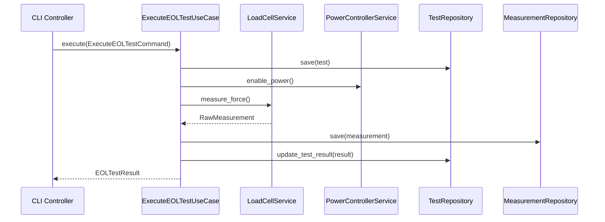

# WF_EOL_TESTER Application Use Cases 상세 설계

## 🎯 핵심 Use Cases 식별

### 1. ExecuteEOLTestUseCase (메인 테스트 실행)

```python
class ExecuteEOLTestUseCase:
    """
    End-of-Line 테스트 전체 시퀀스 실행
    
    이 Use Case는 WF_EOL_TESTER의 핵심 비즈니스 시나리오로,
    하드웨어 초기화부터 측정, 결과 평가까지 전체 과정을 관리합니다.
    """
    
    def __init__(self,
                 # Hardware Services (Application Interface → Infrastructure 구현체)
                 power_service: PowerService,
                 loadcell_service: LoadCellService,
                 dio_service: DIOService,
                 mcu_service: MCUService,
                 robot_service: RobotService,
                 
                 # Data Services
                 test_repository: TestRepository,
                 measurement_repository: MeasurementRepository,
                 
                 # External Services
                 notification_service: NotificationService,
                 report_generator: ReportGeneratorService):
        
        self._power = power_service
        self._loadcell = loadcell_service
        self._dio = dio_service
        self._mcu = mcu_service
        self._robot = robot_service
        self._test_repo = test_repository
        self._measurement_repo = measurement_repository
        self._notifications = notification_service
        self._reports = report_generator
    
    async def execute(self, command: ExecuteEOLTestCommand) -> EOLTestResult:
        """
        EOL 테스트 실행 메인 시나리오
        
        실행 단계:
        1. 테스트 사전 검증
        2. 하드웨어 초기화 및 설정
        3. DUT(Device Under Test) 준비
        4. 측정 시퀀스 실행
        5. 결과 평가 및 Pass/Fail 판정
        6. 데이터 저장 및 보고서 생성
        7. 하드웨어 안전 종료
        """
        
        # 1️⃣ 테스트 준비 및 검증
        test = await self._prepare_test(command)
        
        try:
            # 2️⃣ 하드웨어 초기화
            await self._initialize_all_hardware()
            
            # 3️⃣ DUT 준비 및 검증
            await self._prepare_dut(test.dut_id)
            
            # 4️⃣ 측정 시퀀스 실행
            measurements = await self._execute_measurement_sequence(test)
            
            # 5️⃣ 결과 평가
            test_result = await self._evaluate_test_results(test, measurements)
            
            # 6️⃣ 데이터 저장
            await self._save_test_data(test, measurements, test_result)
            
            # 7️⃣ 보고서 생성 및 알림
            await self._generate_reports_and_notifications(test_result)
            
            return EOLTestResult.from_domain(test_result)
            
        except Exception as e:
            # 에러 처리 및 로깅
            await self._handle_test_failure(test, e)
            raise
            
        finally:
            # 8️⃣ 하드웨어 안전 종료
            await self._shutdown_all_hardware()
    
    async def _execute_measurement_sequence(self, test: EOLTest) -> List[Measurement]:
        """
        실제 측정 시퀀스 - EOL 테스트의 핵심 로직
        
        측정 순서:
        1. 전원 인가 및 안정화
        2. 로드셀 영점 조정
        3. DIO 신호 확인
        4. MCU 통신 테스트
        5. 로봇 동작 테스트
        6. 최종 측정값 수집
        """
        measurements = []
        
        # 전원 인가 측정
        power_measurement = await self._measure_power_consumption(test)
        measurements.append(power_measurement)
        
        # 로드셀 측정
        loadcell_measurement = await self._measure_load_force(test)
        measurements.append(loadcell_measurement)
        
        # DIO 신호 측정
        dio_measurement = await self._test_dio_signals(test)
        measurements.append(dio_measurement)
        
        # MCU 통신 측정
        mcu_measurement = await self._test_mcu_communication(test)
        measurements.append(mcu_measurement)
        
        # 로봇 동작 측정
        robot_measurement = await self._test_robot_motion(test)
        measurements.append(robot_measurement)
        
        return measurements
```


### 2. ControlHardwareUseCase (하드웨어 제어)

```python
class ControlHardwareUseCase:
    """
    개별 하드웨어 제어 Use Case
    
    각 하드웨어 컨트롤러를 독립적으로 제어하기 위한 Use Case입니다.
    테스트 외에도 개별 하드웨어 검증, 설정, 진단에 사용됩니다.
    """
    
    def __init__(self,
                 hardware_controller_factory: HardwareControllerFactory,
                 hardware_status_repository: HardwareStatusRepository):
        self._factory = hardware_controller_factory
        self._status_repo = hardware_status_repository
    
    async def execute(self, command: ControlHardwareCommand) -> HardwareControlResult:
        """
        하드웨어 제어 실행
        
        제어 유형:
        - CONNECT: 하드웨어 연결
        - DISCONNECT: 하드웨어 연결 해제
        - CONFIGURE: 하드웨어 설정
        - DIAGNOSE: 하드웨어 진단
        - RESET: 하드웨어 리셋
        """
        
        # 1️⃣ 하드웨어 컨트롤러 획득
        controller = await self._factory.get_controller(command.hardware_type)
        
        # 2️⃣ 제어 명령 실행
        result = await self._execute_control_command(controller, command)
        
        # 3️⃣ 상태 업데이트
        await self._update_hardware_status(command.hardware_type, result)
        
        return result
    
    async def _execute_control_command(self, 
                                     controller: HardwareController, 
                                     command: ControlHardwareCommand) -> HardwareControlResult:
        """제어 명령별 실행 로직"""
        
        match command.control_type:
            case ControlType.CONNECT:
                return await self._connect_hardware(controller, command)
            
            case ControlType.DISCONNECT:
                return await self._disconnect_hardware(controller)
            
            case ControlType.CONFIGURE:
                return await self._configure_hardware(controller, command.configuration)
            
            case ControlType.DIAGNOSE:
                return await self._diagnose_hardware(controller)
            
            case ControlType.RESET:
                return await self._reset_hardware(controller)
            
            case _:
                raise UnsupportedControlTypeError(f"Unknown control type: {command.control_type}")
```

### 3. GenerateTestReportUseCase (보고서 생성)

```python
class GenerateTestReportUseCase:
    """
    테스트 보고서 생성 Use Case
    
    완료된 EOL 테스트 결과를 기반으로 다양한 형태의 보고서를 생성합니다.
    Excel, PDF, CSV 등 다양한 포맷을 지원합니다.
    """
    
    def __init__(self,
                 test_repository: TestRepository,
                 measurement_repository: MeasurementRepository,
                 report_generator: ReportGeneratorService,
                 file_export_service: FileExportService):
        self._test_repo = test_repository
        self._measurement_repo = measurement_repository
        self._report_generator = report_generator
        self._file_export = file_export_service
    
    async def execute(self, command: GenerateReportCommand) -> ReportGenerationResult:
        """
        보고서 생성 실행
        
        생성 단계:
        1. 테스트 데이터 수집
        2. 측정 데이터 집계
        3. 통계 분석
        4. 보고서 생성
        5. 파일 내보내기
        """
        
        # 1️⃣ 데이터 수집
        test_data = await self._collect_test_data(command)
        
        # 2️⃣ 보고서 생성
        report = await self._generate_report(test_data, command.report_format)
        
        # 3️⃣ 파일 내보내기
        file_path = await self._export_report_file(report, command)
        
        return ReportGenerationResult(
            report_id=ReportId.generate(),
            file_path=file_path,
            report_format=command.report_format,
            generated_at=datetime.now()
        )
```

## 🔄 Use Case 상호작용 다이어그램



## 📋 Command 객체 설계

### ExecuteEOLTestCommand
```python
@dataclass
class ExecuteEOLTestCommand:
    dut_id: DUTId
    test_type: TestType
    operator_id: OperatorId
    test_configuration: TestConfiguration
    quality_requirements: QualityRequirements
    
    def validate(self) -> None:
        """명령 유효성 검증"""
```


## 🔌 Service 인터페이스 (Dependency Inversion)

```python
# Hardware Services (Application Layer에서 정의)

# src/application/interfaces/power_service.py
class PowerService(ABC):
    @abstractmethod
    async def set_voltage(self, voltage: Voltage) -> None:
        pass
    
    @abstractmethod
    async def enable_output(self) -> None:
        pass
    
    @abstractmethod
    async def measure_current_consumption(self) -> Current:
        pass

# src/application/interfaces/loadcell_service.py
class LoadCellService(ABC):
    @abstractmethod
    async def read_force_value(self) -> ForceValue:
        pass
    
    @abstractmethod
    async def perform_zero_calibration(self) -> CalibrationResult:
        pass

# src/application/interfaces/dio_service.py
class DIOService(ABC):
    @abstractmethod
    async def read_input_port(self, port: int) -> bool:
        pass
    
    @abstractmethod
    async def write_output_port(self, port: int, value: bool) -> None:
        pass

# src/application/interfaces/mcu_service.py
class MCUService(ABC):
    @abstractmethod
    async def send_command(self, command: MCUCommand) -> MCUResponse:
        pass

# src/application/interfaces/robot_service.py
class RobotService(ABC):
    @abstractmethod
    async def move_to_position(self, position: Position) -> None:
        pass

# Data Services
class TestRepository(ABC):
    @abstractmethod
    async def save(self, test: EOLTest) -> EOLTest:
        pass
    
    @abstractmethod
    async def find_by_id(self, test_id: TestId) -> Optional[EOLTest]:
        pass

# External Services
class NotificationService(ABC):
    @abstractmethod
    async def send_test_completion_notification(self, result: TestResult) -> None:
        pass
```

이 설계는 현재 WF_EOL_TESTER의 하드웨어 제어 로직을 Clean Architecture의 Application Layer로 체계적으로 재구성한 것입니다.